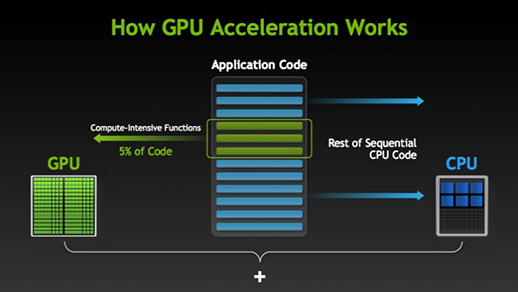
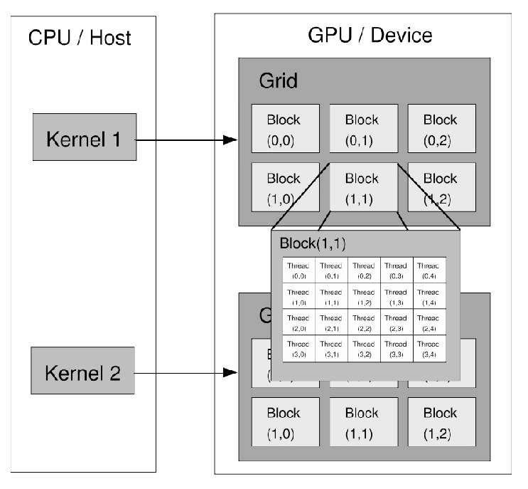
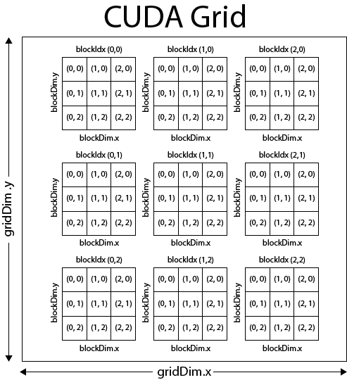

# CUDA

## Introdução 

CUDA (Compute Unified Device Architecture) é uma plataforma de computação paralela e um modelo de programação desenvolvidos pela NVIDIA. Seu propósito é permitir que programadores aproveitem a capacidade massivamente paralela das GPUs para realizar tarefas de propósito geral, por meio de extensões da linguagem C/C++.

## Organização

Na programação com CUDA, tanto a CPU, quanto a GPU são utilizadas, tipicamente, a primeira é chamada de **host**, e a segunda **device**. 
Dessa forma, geralmente, a computação serial é executada no host e a paralela é delegada ao device, ou seja, o código host carrega os dados e dispara **kernels** (“funções”) no device, no modelo **SIMT** (Single Instruction Multiple Threads), no qual milhares de **threads** podem  ser executadas.



## Hello World!

```c
#include <stdio.h>

__global__ void ola_cuda() {
    printf("Ola mundo da GPU!\n");
}

int main() {
	ola_cuda<<<1, 1>>>();
	cudaDeviceSynchronize();
	return 0;
}
```

É possível se observar que o programa acima se parece bastante com um código fonte C/C++ padrão. Suas principais diferenças são:

1. **__global__**: definição de um **kernel**, ou seja, uma função que roda na GPU e pode ser chamada em código da CPU;
2. **...<<<1, 1>>>**: sintaxe de lançador de kernel, isto é, chamada a um kernel. O primeiro valor indica o número de **blocos** utilizados na grid de execução daquele kernel, enquanto o segundo, indica o número de **threads** em cada bloco (logo entraremos em mais detalhes do significado de todos esses tremos);
3. **cudaDeviceSynchronize**: função que garante que todas as operações CUDA na GPU sejam finalizadas antes que o código da CPU continue sua execução.

## Arquitetura

Para entender melhor a arquitetura de execução de códigos CUDA, é importante detalhar os conceitos supracitados de: **threads**, **blocos** e **grid**. As GPUs CUDA executam os kernels usando blocos de threads (sempre com um tamanho múltiplo de 32), e o conjunto dos blocos formam a grid.




Durante a programação dos kernels, são utilizadas variáveis para acessar informações dos índices, identificadores e dimensões das threads, blocos e grids em execução:



* **threadIdx**: vetor de 3 componentes (x, y, z) que contém o índice da thread dentro do seu bloco;
* **blockIdx**: análogo ao threadIdx, porém indexa o bloco dentro de seu grid;
* **blockDim**: dimensão do bloco de threads (número de threads), também com 3 componentes;
* **gridDim**: análogo ao blockDim, porém para a grid, ou seja, número de blocos dentro dela.

O índice de uma thread e seu ID se relacionam de forma simples, com esses cálculos sendo comumente observados em praticamente qualquer código CUDA: 
* Para um bloco unidimensional, eles são iguais; 
* Para um bloco bidimensional de tamanho (Dx, Dy), o ID da thread com índice (x, y) é (x + y Dx);
* Para um bloco tridimensional de tamanho (Dx, Dy, Dz), o ID da thread com índice (x, y, z) é (x + y Dx + z Dx Dy).

Dessa forma, pode-se observar que há uma flexibilidade quanto a lógica dimensional utilizada para lidar com a grid, blocos e threads. Ou seja, o programador pode escolher organizar os dados e as threads em 1D, 2D ou 3D de acordo com a estrutura do problema (por exemplo, vetores, matrizes ou volumes). 

### Execução Baixo Nível

No que diz respeito a execução, cada bloco executa de forma independente em um **Streaming Multiprocessor** (**SM**) da GPU, porém, todas as threads de um bloco devem estar no mesmo SM. Dito isso, atualmente, o limite de threads por bloco é 1024.

As threads dentro do mesmo bloco podem cooperar (usando memória compartilhada com \_\_shared__ e barreiras __syncthreads()), mas threads de blocos diferentes não podem sincronizar diretamente.

Internamente, cada bloco é subdividido em **warps** (grupos de 32 threads), que correspondem à unidade básica de execução na GPU. Cada warp executa instruções de forma síncrona no modelo **SIMT** (SINGLE INSTRUCTION MULTIPLE THREADS), mas ramificações condicionais podem causar divergência entre threads de um mesmo warp, resultando em execução serial dos caminhos divergentes. 

O escalonamento de warps nos multiprocessadores ocorre de forma dinâmica, permitindo que, enquanto algumas threads aguardam acesso à memória, outras sejam executadas, maximizando a utilização das unidades de processamento. O número de blocos e warps que podem ser simultaneamente ativos em um multiprocessador é limitado pelos recursos disponíveis (registradores, memória compartilhada etc.), definindo assim a ocupação (occupancy) da GPU.

## Memória 

A CPU e a GPU são entidades distintas, sendo assim, cada uma tem seu próprio espaço de memória e uma não consegue acessar o espaço da outra de forma direta. Logo, existem algumas funções comumente utilizadas para lidar com a memória do device:

* **cudaMalloc**: aloca memória na GPU.
* **cudaFree**: libera memória na GPU.
* **cudaMemcpy**: transfere (copia) memória entre a CPU e a GPU, ou vice versa.

Dito isso, geralmente, um programa CUDA segue o seguinte fluxo:
1. Alocação de memória no host (mallloc) e inicialização dos dados;
2. Alocação de memória no device (cudaMalloc);
3. Transferência de dados de entrada do host para o device (cudaMemcpy);
4. Execução dos kernels;
5. Transferência de dados de saída do device para o host (cudaMemcpy);


## Exemplos de Código

### Preparações

Para programar em CUDA, você precisa possuir uma GPU NVIDIA e instalar o [CUDA Toolkit](https://developer.nvidia.com/cuda-toolkit). Após a instalação, o `nvcc` é utilizado para compilar o código. 

### Exemplos

1. [Ola Mundo](codes/ola_mundo.cu)
2. [Soma de Vetores](codes/soma_vetor.cu)
3. [Soma de Matrizes](codes/soma_matriz.cu)
4. [Soma de Tensores Tridimensionais](codes/soma_matriz.cu)
5. [Cálculo de um Fractal Julia](codes/fractal.cu)

## Bibliografia

NVIDIA CORPORATION. CUDA C Programming Guide. [S.l.], 2024. Disponível em: https://docs.nvidia.com/cuda/cuda-c-programming-guide/index.html. Acesso em: 8 jun. 2025.